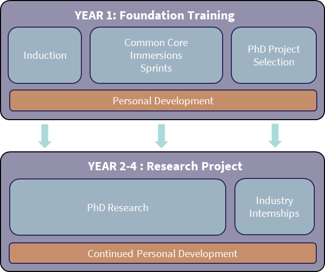

# Our Training Programme

## Year 1

The Year 1 Foundation training is delivered across our University partners throughout the UK.

### Common Core Syllabus

In-person and digital distance learning, delivered by HDR UK researchers, Turing Fellows and representatives of our non academic partners  to provide all students with a common and in-depth foundational background in the data and health sciences.

Example topics include:

- Foundations of Probability and Statistics
- Machine Learning
- Reproducible Science
- Data Ethics
*to be completed*

### Immersions

Residentials immersion events to gain deep insight into the work of HDR UK, our NHS and industry partners; meet potential PhD supervisors at each of our regional sites; intensive data dives tackling a real-world problem using a team-based approach.

Example immersion topics include:

- Risk Prediction Models
- Clinical Trials
- Epidemiology
- Bioinformatics
*to be completed*

### Researcher Development

Training delivered by academic, industry and NHS experts to promote personal and professional development in leadership capability, cross-sector collaborative skills and inter-disciplinary working.

## Years 2-4

During years 2-4, you will select a research project based on your interests from year 1, undertaken at one of our [partner universities](partners.md). Throughout the programme you will be co-supervised by *at least* one expert in quantitative methods and one in substantive health research, with potential input from non-academic partner organisations.

### Example PhD research projects

*to be completed*

